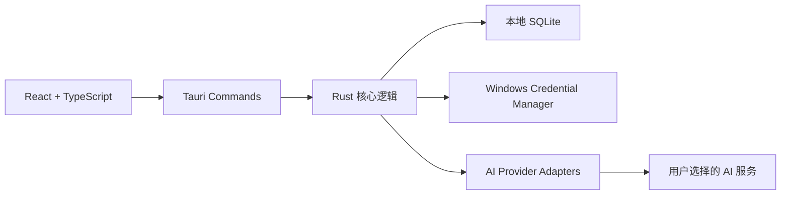

# Tomato Companion

> Windows 本地优先的番茄钟、项目任务管理与 AI 学习伙伴。

Tomato Companion 是一款可安装到 Windows 的桌面应用。它把番茄钟、学习项目、任务拆解、专注统计和可长期陪伴的 AI 伙伴放在同一个程序中。除调用用户选择的 AI 服务外，任务、番茄记录、对话和记忆均保存在用户本机。

当前版本：`v0.3.0`

## 核心功能

### 番茄专注

- 自定义专注、短休息和长休息时长
- 根据目标时间恢复计时，减少切换窗口或系统休眠造成的偏差
- 可选择关联任务，完成后自动增加任务番茄进度
- 每次完成专注，番茄罐中都会落入一颗带动画的番茄

### 项目与任务

- 创建独立任务并设置优先级、预计番茄数
- 使用项目组管理一个长期目标下的多条番茄任务
- 查看项目任务数量、番茄进度和整体完成情况
- AI 拆解结果可逐项选择、修改后导入
- 支持新建项目、合并到已有项目，或直接导入普通任务列表

### AI 学习伙伴

- 可为伙伴设置姓名
- 提供温柔陪伴、行动教练、理性导师、元气同伴四种初始风格
- 底层统一封装身份提示词、对话窗口、滚动摘要和长期记忆
- 支持 Markdown 标题、列表、引用、粗体和代码块显示
- 默认每完成 2 颗番茄主动询问学习情况，频率可调整或关闭
- 可将学习目标拆成一颗颗能够直接开始的番茄任务

### 统计与回顾

- 查看今日、本周、本月完成的番茄数
- 查看专注时长、活跃天数和每日分布
- 在动态番茄罐中直观看到积累成果

## 支持的 AI 服务

| 服务 | 接入方式 | API Key |
| --- | --- | --- |
| DeepSeek | OpenAI 兼容接口 | 需要 |
| OpenAI | OpenAI API | 需要 |
| 通义千问 | 阿里云百炼兼容接口 | 需要 |
| Anthropic Claude | Messages API | 需要 |
| Google Gemini | Generate Content API | 需要 |
| Ollama | 本地接口 | 不需要 |

使用时进入“设置 → 模型连接”，选择服务商，然后输入 API Key 和具体模型 ID/名称即可。请求端点和各服务商的协议差异已经封装在 Rust 后端中。

> 模型 ID 必须是对应账号当前可以使用的真实模型名称。例如 DeepSeek 可填写 `deepseek-chat`。不同服务商的可用模型可能随时间或账号权限变化。

## 安装

普通用户应安装以下文件：

```text
src-tauri\target\release\bundle\nsis\Tomato Companion_0.3.0_x64-setup.exe
```

安装器为当前 Windows 用户安装应用，不需要网页服务器。构建目录中同时会生成原生程序：

```text
src-tauri\target\release\tomato-companion.exe
```

当前安装包尚未使用商业代码签名证书，Windows SmartScreen 可能显示“未知发布者”。正式公开分发前建议加入代码签名和自动更新流程。

## AI 记忆机制

每次普通对话会组合以下上下文：

1. 当前对话的滚动摘要
2. 最多 12 条相关长期记忆
3. 最近 30 条原始消息，并限制总字符规模

每新增 24 条消息，程序会调用当前模型整理滚动摘要，并提取稳定的学习目标、偏好、背景和学习方式。一次性闲聊不会被当成长久记忆；API Key、密码、联系方式、证件及健康隐私会被明确排除。用户也可以在伙伴页面逐条删除记忆。

主动互动由番茄完成事件触发。系统只把最近的任务和专注时长作为隐藏学习事件交给伙伴，生成一条简短、具体的问题。即使 AI 请求失败，计时结束、任务进度和番茄入罐也不会受到影响。

## 本地数据与隐私

| 数据 | 保存位置 |
| --- | --- |
| 任务、项目、番茄、对话、记忆与设置 | 本地 SQLite |
| API Key | Windows Credential Manager |
| WebView2 运行数据 | Windows 本地应用数据目录 |

SQLite 数据库默认位于：

```text
%APPDATA%\com.tomato.companion\tomato-companion.db
```

WebView2 运行数据默认位于：

```text
%LOCALAPPDATA%\com.tomato.companion\
```

API Key 使用的 Windows Credential Manager 服务名为 `Tomato Companion`，不会写入 SQLite、前端状态或日志。

## 技术架构



- 桌面框架：Tauri 2
- 前端：React 19、TypeScript、Vite、Zustand
- 后端：Rust
- 本地数据库：SQLite
- 密钥存储：Windows Credential Manager
- Windows 安装器：NSIS

更详细的数据表、模型适配和记忆生命周期参见 [架构文档](docs/ARCHITECTURE.md)。

## 本地开发

### 环境要求

- Windows 10/11 x64
- Node.js 20 或更高版本
- Rust stable（MSVC 工具链）
- Microsoft Edge WebView2 Runtime

安装依赖：

```powershell
npm install
```

启动完整桌面开发环境：

```powershell
npm run tauri:dev
```

仅启动前端预览：

```powershell
npm run dev
```

前端预览不会启用 Windows Credential Manager 或真实 AI 请求，完整能力需要在 Tauri 桌面环境中测试。

## 测试与构建

```powershell
# 前端测试
npm test

# TypeScript 与前端生产构建
npm run build

# Rust 测试
cargo test --manifest-path src-tauri/Cargo.toml

# 生成 Windows NSIS 安装包
npm run tauri:build
```

首次 Rust 构建会下载依赖。项目中的 `.cargo/config.toml` 使用 RsProxy 稀疏镜像，以改善中国大陆网络环境下连接 crates.io 的稳定性。

## 项目目录

```text
tomato/
├─ src/                   React 前端、页面、状态与组件
├─ src-tauri/src/         Rust 命令、数据库与 AI 适配
├─ src-tauri/icons/       Windows 应用图标
├─ docs/                  架构与技术文档
├─ public/                静态资源
└─ design-system/         UI 设计约定
```

## 后续规划

- AI 回复流式输出、停止生成与重新生成
- Windows 系统托盘、专注结束通知和单实例运行
- 数据导出、备份、恢复和一键完全删除
- 对话与记忆搜索
- 自动更新、代码签名和发布流水线

## 可选的组队学习云端

当前版本已加入可选的账号、团队、邀请码和同步学习房间。未登录或服务器不可用时，本地番茄钟、任务、项目、番茄罐、统计和 AI 伙伴仍可正常使用。

- Access Token 只保存在 Rust 内存中。
- Refresh Token 保存在 Windows Credential Manager（服务名 `Tomato Companion Auth`）。
- 云端只保存账号、团队、房间和远程 Session。
- 本地任务、AI 对话、长期记忆、API Key 和 SQLite 数据库不会上传。
- 远程番茄完成后使用远程 Session ID 幂等写入本地番茄罐。

服务端开发启动：

```powershell
cd server
.\mvnw.cmd spring-boot:run
```

生产部署请参阅 [Ubuntu 云端部署](docs/DEPLOY_UBUNTU.md)，API、WebSocket 与安全边界分别记录在 `docs/API.md`、`docs/WEBSOCKET.md` 和 `docs/SECURITY.md`。

## 许可证

本仓库目前尚未添加开源许可证。在许可证明确之前，代码默认保留全部权利。
