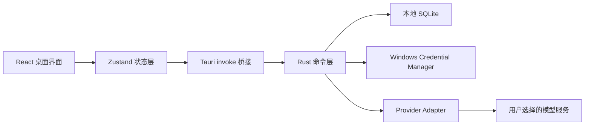
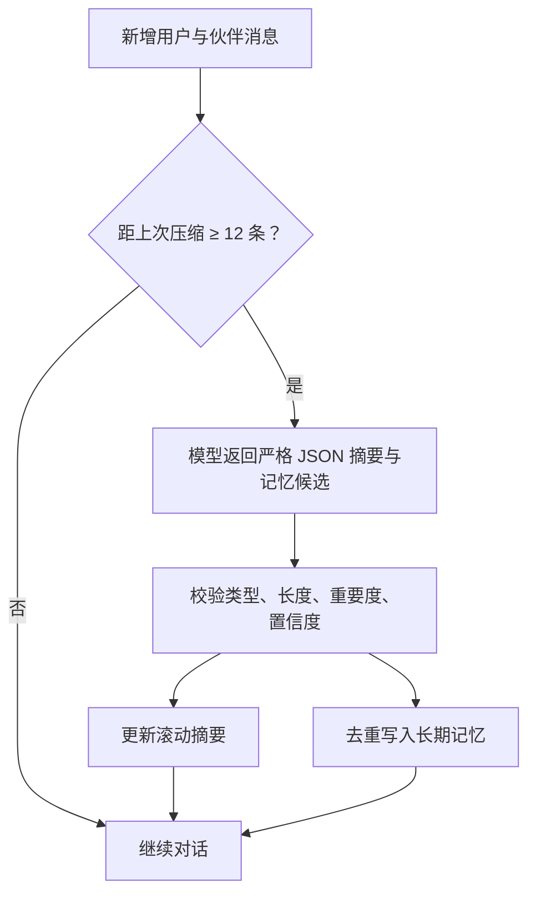

# Tomato Companion 技术架构

## 1. 技术选型

- 桌面容器：Tauri 2
- 前端：React 19、TypeScript、Vite、Zustand
- 原生后端：Rust
- 本地数据库：SQLite（rusqlite，bundled）
- 密钥保管：Windows Credential Manager（keyring）
- 网络请求：reqwest + rustls
- Windows 安装器：NSIS
- 图标：Lucide React
- 字体：随安装包内置 Lora 与 Raleway，不依赖在线字体

采用 Tauri 的原因是安装体积小、Rust 可承载本地数据库和密钥逻辑，并且前端界面仍可使用成熟的 React 生态。程序启动后加载打包在 EXE 内的静态资源，不启动网页服务。

## 2. 模块边界

前端永远拿不到已保存的 API Key。Rust 命令层根据 Provider ID 从 Credential Manager 取出密钥，组装请求并直接调用模型服务。

## 3. 内置模型适配

| 服务商 | 协议适配 | 默认端点 |
| --- | --- | --- |
| DeepSeek | OpenAI Chat Completions 兼容 | `https://api.deepseek.com` |
| OpenAI | OpenAI Chat Completions | `https://api.openai.com/v1` |
| 通义千问 | OpenAI 兼容 | `https://dashscope.aliyuncs.com/compatible-mode/v1` |
| Anthropic Claude | Messages API | `https://api.anthropic.com/v1/messages` |
| Google Gemini | Generate Content API | `https://generativelanguage.googleapis.com/v1beta` |
| Ollama | 本地 Chat API | `http://127.0.0.1:11434/api/chat` |

普通用户只看到服务商、连接名称和 API Key。高级设置仅允许覆盖模型 ID；Base URL 不在普通界面暴露，减少配置错误。

## 4. 伙伴身份与提示词

伙伴资料保存在 `companion_profile` 单例表，包括姓名、风格 ID 和更新时间。四种风格对应 Rust 内置提示词：

- `gentle`：温柔、低压力、先理解再行动
- `coach`：直接、清晰、强调下一步与完成标准
- `rational`：结构化、讲原理和依据、标注不确定性
- `energetic`：积极但克制，庆祝具体进展

系统提示词还包含统一规则：将学习目标拆成 1–3 颗番茄的小步骤、不给虚假信息、不索取敏感数据、不把记忆当成绝对事实。

## 5. 对话窗口与记忆生命周期

每次请求的上下文由三部分组成：

1. 当前对话的滚动摘要
2. 最多 8 条按 `importance × confidence` 排序的长期记忆
3. 最近 12 条原始消息

每当“当前消息总数 − 上次压缩位置”达到 12 条，后台额外执行一次记忆压缩：

允许的记忆类型只有 `preference`、`goal`、`study_pattern`、`background`。提示词要求排除 API Key、密码、联系方式、身份证件、健康隐私和一次性闲聊。原始消息仍保存在本机；压缩只控制后续发送给模型的上下文长度。

## 6. 本地数据表

- `tasks`：任务、状态、优先级、估算与完成番茄数
- `projects`：学习项目名称、说明与更新时间
- `pomodoro_sessions`：开始/结束时间、计划/实际秒数、关联任务
- `provider_connections`：服务商类型、端点、默认模型，不含密钥
- `companion_profile`：伙伴姓名与初始风格
- `conversations`：对话标题、滚动摘要、压缩位置
- `messages`：本地完整对话
- `memories`：长期记忆、重要度、置信度与来源对话
- `app_settings`：当前计时器等 JSON 设置

SQLite 开启 WAL、外键和 5 秒 busy timeout。API Key 不进入任何数据表。

## 7. 番茄罐与统计

每条完成的 `pomodoro_sessions` 记录就是一颗番茄。罐子最多同时绘制最近 36 颗番茄，通过会话 ID 生成稳定位置和角度，最新一颗使用 CSS 落入动画；系统启用“减少动态效果”时动画自动缩短。

统计按本机时区计算：

- 今日：当天 00:00 至当前时间
- 本周：周一 00:00 至当前时间
- 本月：当月 1 日 00:00 至当前时间

## 8. 发布

`npm run tauri:build` 生成：

- 原生程序：`src-tauri/target/release/tomato-companion.exe`
- NSIS 安装器：`src-tauri/target/release/bundle/nsis/*-setup.exe`

## 9. AI 学习计划导入

学习计划使用单独的 Rust 命令请求严格 JSON，包含项目名称、阶段目标以及 3–12 个番茄任务。AI 结果不会直接写入数据库，而是先进入导入确认面板：

1. 用户逐项选择或取消任务；
2. 可修改任务名称、预计番茄数和优先级；
3. 选择创建新项目、合并已有项目或不归项目；
4. 最终确认后，项目和任务在同一个 SQLite 事务中原子写入。

这种两阶段设计避免模型输出错误时污染任务列表，也允许用户保留最终控制权。

正式公开发布前仍需完成商业代码签名、自动更新服务和安装器升级/回滚测试。
