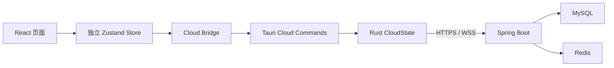
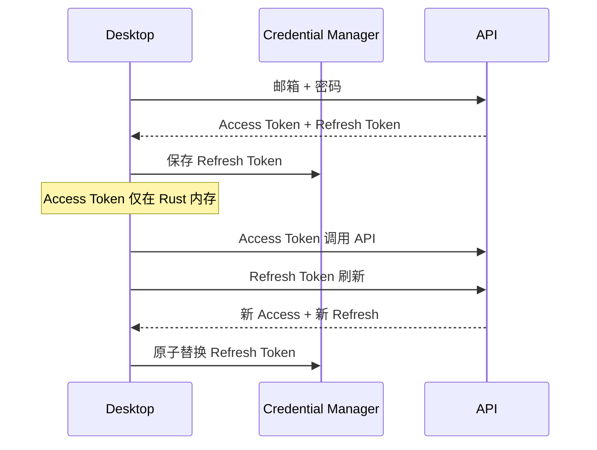
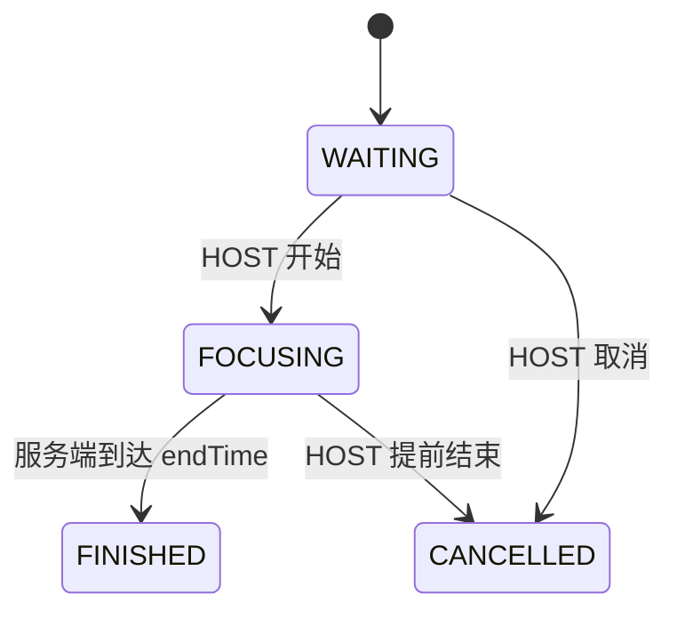

# Tomato Companion 云端架构

## 1. 目标与边界

Tomato Companion 继续以 Windows 本地优先桌面程序为核心。云端是可选能力，断网、未登录或服务器不可用时，个人番茄、任务、项目、番茄罐、统计、AI 对话、记忆和模型配置仍可正常使用。



本地功能继续使用：

```text
React → useAppStore → src/lib/bridge.ts → Rust commands → SQLite / Credential Manager / AI
```

云端功能使用：

```text
React → useAuthStore/useTeamStore/useStudyRoomStore
      → src/lib/cloud/*
      → src-tauri/src/cloud/*
      → Spring Boot
```

禁止上传完整本地任务、番茄历史、AI 对话、长期记忆、API Key 和 SQLite 文件。

## 2. 客户端模块

### React

- `useAuthStore`：恢复会话、注册、登录、更新资料、退出。
- `useTeamStore`：队伍列表、当前队伍、邀请码、成员和权限错误。
- `useStudyRoomStore`：房间快照、成员、服务器会话、连接和重连状态。
- `src/lib/cloud/*`：只封装 Tauri invoke 和 Tauri Event，不直接发起公网请求。
- `AuthDialog`：不持久化原始密码，不引入 Router。

### Rust

`CloudState` 独立于 `DbState`，包含：

- 可复用 `reqwest::Client`；
- 仅存在 Rust 内存的 Access Token；
- 当前用户；
- 可取消的单一 WebSocket 任务；
- 固定的受信任服务端地址。

Refresh Token 使用独立的 Windows Credential Manager 服务 `Tomato Companion Auth`，账户名为 `refresh-token`。任何 Token 都不得写入 SQLite、localStorage、日志或 React 持久化状态。

## 3. 服务端模块

`server/` 使用 Controller → Service → Repository → MySQL 分层。

- `auth`：注册、登录、Refresh Token 轮换、撤销。
- `user`：当前用户资料。
- `team`：队伍、成员、角色、邀请码。
- `room`：房间、准备状态与权限。
- `study`：服务器权威 Session 和参与记录。
- `websocket`：认证、状态同步、心跳和事件广播。
- `security`：JWT、请求 ID、限流和敏感日志过滤。

MySQL 是长期业务数据的唯一真源。Redis 只保存在线状态、心跳、限流计数、节点映射和短期缓存。

## 4. 数据库设计

云端 MySQL 使用 Flyway 管理以下表，ID 统一采用 UUID 字符串：

| 表 | 作用 | 关键约束 |
| --- | --- | --- |
| `users` | 账号与公开资料 | `UNIQUE(email)` |
| `refresh_tokens` | Token 哈希、轮换和撤销 | Token 哈希唯一 |
| `teams` | 队伍、OWNER、邀请码 | `UNIQUE(invite_code)` |
| `team_members` | 队伍角色 | `UNIQUE(team_id,user_id)` |
| `study_rooms` | 队伍活跃房间 | 状态索引 |
| `room_members` | 准备、加入和离开 | 活跃成员唯一 |
| `study_sessions` | 权威开始/结束时间 | 房间和状态索引 |
| `session_participants` | 完成记录 | `UNIQUE(session_id,user_id)` |

删除队伍不会级联删除已完成的学习历史。业务删除通过服务层显式处理。

阶段 5 才为本地 SQLite 增加：

- `pomodoro_sessions.source`：`local` 或 `team`；
- `pomodoro_sessions.remote_session_id`：可空且唯一。

## 5. Token 生命周期



- Access Token 默认 20 分钟。
- Refresh Token 默认 30 天。
- 服务端只保存 Refresh Token 的 SHA-256 哈希。
- 每次刷新均轮换，旧 Token 立即撤销。
- 退出时撤销当前 Refresh Token 并清理 Credential Manager。

## 6. 房间状态机



Session 独立状态为 `SCHEDULED`、`RUNNING`、`FINISHED`、`CANCELLED`。第一版不支持暂停，每个队伍最多一个活跃房间，每个房间最多一个活跃 Session。

## 7. 服务器权威计时

客户端根据服务端返回的 `serverTime` 计算偏移：

```text
serverOffset = serverTime - clientReceiveTime
estimatedServerNow = Date.now() + serverOffset
remaining = endTime - estimatedServerNow
```

完成状态只由服务端产生。MySQL 持久化 `start_time` 和 `end_time`，服务重启后可恢复并完成过期 Session；Redis 不能成为时间和完成记录的唯一来源。

## 8. 分阶段实施

1. 服务端骨架与认证。
2. 桌面端登录闭环。
3. 队伍与邀请码。
4. 房间、WebSocket 和断线恢复。
5. 组队番茄本地幂等落地。
6. Docker Compose、Nginx、HTTPS 与 Ubuntu 部署。

每个阶段必须保持现有前端、Rust 和服务端可构建，不以删除测试换取通过。

## 9. 风险

- WebSocket 客户端必须支持握手 `Authorization` Header；若库限制则改用一次性短期 ticket。
- 客户端重连可能重复收到完成事件，必须由云端参与记录和本地唯一索引双重去重。
- 真实生产地址、域名、TLS 证书和强随机 JWT Secret 只能在部署环境注入。
- Docker 不可用时只能验证 Compose 配置，不能声称完成集成启动。
- Spring Boot 3.5 已处于 3.x 最后维护线，上线前需评估迁移到受支持的 4.x。
